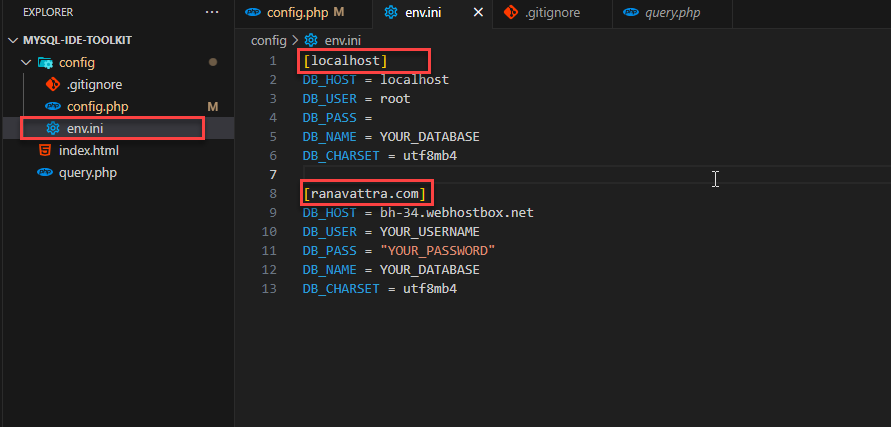
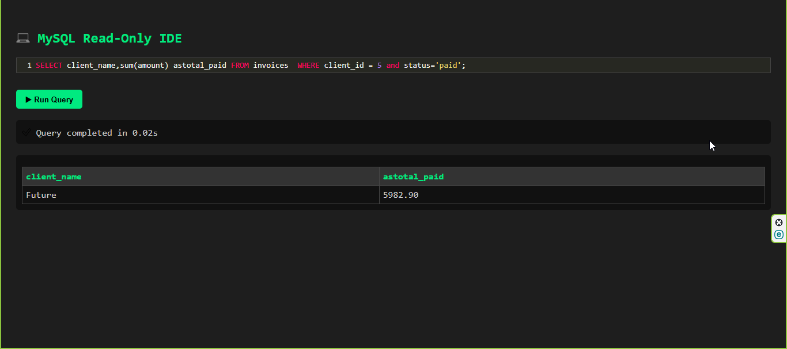

# MySQL IDE Toolkit (PHP)

## 📘 Description

**MySQL IDE Toolkit** is a lightweight PHP-based web interface designed to simplify the process of querying MySQL databases. It supports custom SQL queries with a focus on **read-only** operations, making it a secure and efficient tool for developers, analysts, and database administrators. This project is built using:

* 🐘 PHP
* 🐬 MySQL
* 🌐 HTML, CSS (Bootstrap)
* ⚙️ JavaScript, jQuery

## 📑 Table of Contents

1. [Getting Started](#getting-started)
2. [Prerequisites](#prerequisites)
3. [Installation](#installation)
4. [Usage](#usage)
5. [Contributing](#contributing)
6. [License](#license)
7. [Acknowledgments](#acknowledgments)

## 🚀 Getting Started

Follow the instructions below to get your MySQL IDE Toolkit up and running on your local machine or development environment.

## 🔧 Prerequisites

Make sure you have the following installed:

* PHP 7.4 or later
* MySQL Server
* Apache/Nginx (or use XAMPP/Laragon for simplicity)
* Composer (optional, if dependencies are used)
* Git

## 💾 Installation

1. Clone the repository:

   ```bash
   git clone https://github.com/VattraF4/MySQL-IDE-Toolkit-PHP.git
   ```
2. Navigate to the project directory:

```
cd MySQL-IDE-Toolkit-PHP
```

3. (Optional) If you're using .env or env.ini, copy the sample config file:

```
cp config/env.sample.ini config/env.ini
```

4. Set your database connection settings in config/env.ini:
```
[localhost]
DB_HOST = localhost
DB_USER = root
DB_PASS =
DB_NAME = YOUR_DATABASE
DB_CHARSET = utf8mb4

[ranavattra.com]
DB_HOST = bh-34.webhostbox.net
DB_USER = YOUR_USERNAME
DB_PASS = "YOUR_PASSWORD"
DB_NAME = YOUR_DATABASE
DB_CHARSET = utf8mb4

```
5. (If applicable) Install dependencies using Composer:

```
composer install
```

## 💡 Usage
1. Start your server (Apache, XAMPP, Laragon, etc.)

2. Open your browser and go to:

```
http://localhost/MySQL-IDE-Toolkit-PHP/
Input your SQL query (read-only, e.g. SELECT * FROM your_table) and run it.
```

3. View results in a styled, user-friendly table.

⚠️ Note: Only SELECT queries are allowed. INSERT, UPDATE, DELETE, or other altering operations are blocked for safety.

## 🤝 Contributing
Contributions are welcome! Here's how to contribute:

1. Fork the repository

2. Create your branch:

```
git checkout -b feature/your-feature-name
```

3. Commit your changes:

```
git commit -m "Add: your message"
```

4. Push your changes:

```
git push origin feature/your-feature-name
```

5. Open a pull request on GitHub

## 📜 License

### MIT License

**Copyright (c) [2025] [Ra Vattra Team]**

Permission is hereby granted, free of charge, to any person obtaining a copy
of this software and associated documentation files (the "Software"), to deal
in the Software without restriction, including without limitation the rights
to use, copy, modify, merge, publish, distribute, sublicense, and/or sell
copies of the Software, and to permit persons to whom the Software is
furnished to do so, subject to the following conditions:

The above copyright notice and this permission notice shall be included in all
copies or substantial portions of the Software.

THE SOFTWARE IS PROVIDED "AS IS", WITHOUT WARRANTY OF ANY KIND, EXPRESS OR
IMPLIED, INCLUDING BUT NOT LIMITED TO THE WARRANTIES OF MERCHANTABILITY,
FITNESS FOR A PARTICULAR PURPOSE AND NONINFRINGEMENT. IN NO EVENT SHALL THE
AUTHORS OR COPYRIGHT HOLDERS BE LIABLE FOR ANY CLAIM, DAMAGES OR OTHER
LIABILITY, WHETHER IN AN ACTION OF CONTRACT, TORT OR OTHERWISE, ARISING FROM,
OUT OF OR IN CONNECTION WITH THE SOFTWARE OR THE USE OR OTHER DEALINGS IN THE
SOFTWARE.

### Additional Notes
- This license allows commercial use, modification, distribution and private use
- Includes limitation of liability and warranty disclaimer
- You must include the original copyright notice
- Not compatible with GPL (as it's more permissive)
- [Full license text](ranavattra.com) available in project repository

For alternative licenses, please contact the author.

## 🖼️ Screenshots

### Project


### Tools
<p align="center">
  
  <br>
  <em>Example query results with pagination</em>
</p>

### Query
[
### Query Results
<p align="center">
  
  <br>
  <em>Example query results with pagination</em>
</p>
